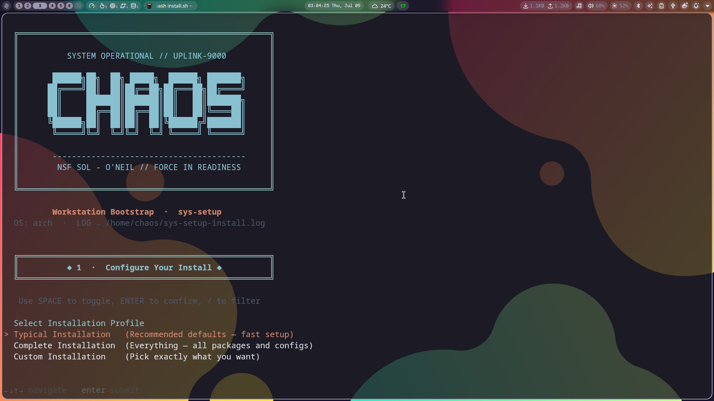
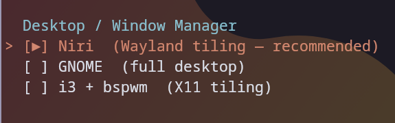
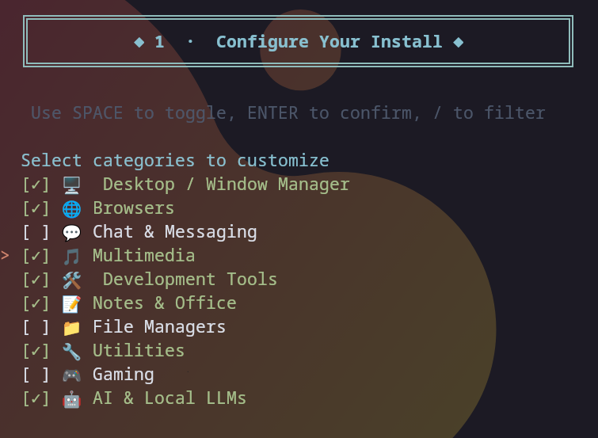
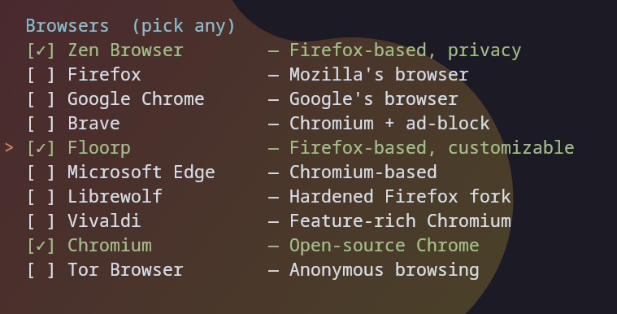

# sys-setup

> One command to restore my entire workstation across Arch, Ubuntu, Fedora, and macOS.

[](https://archlinux.org/)
[](https://ubuntu.com/)
[](https://fedoraproject.org/)
[](https://apple.com/)
[](LICENSE)

## Machine

- **Host**: MSI Thin GF63 12HW
- **CPU**: Intel Core i5-12500H (16 threads)
- **GPU**: Intel Arc A370M + Iris Xe
- **Display**: 1920×1080 @ 144Hz
- **OS**: Linux (Arch, Ubuntu, Fedora) / macOS

## Usage

### On a fresh install:

```bash
bash <(curl -sL https://raw.githubusercontent.com/as-repo1/sys-setup/master/install.sh)
```

### From a local clone:

```bash
git clone https://github.com/as-repo1/sys-setup.git ~/coding/sys-setup
cd ~/coding/sys-setup
bash install.sh
```

### Dry run (see what will happen without making changes):

```bash
bash install.sh --dry-run
```

---

## What It Does

The installer runs through **10 phases** interactively with a Nord-themed CRT terminal UI:

| Phase | Description                                                 |
| ----- | ----------------------------------------------------------- |
| 0     | Preflight checks (user, OS detection, package manager)      |
| 1     | Interactive profile selection (Typical / Complete / Custom) |
| 2     | Mirror ranking (Arch) / Package sources (Ubuntu/Fedora)     |
| 3     | Chaotic-AUR / RPM Fusion / Ubuntu Extras                    |
| 4     | Install AUR helpers, PPAs, or COPRs                         |
| 5     | Install packages (Native → Flatpak fallback)               |
| 6     | Enable systemd services                                     |
| 7     | Stow dotfiles                                               |
| 8     | Download & register AppImages                               |
| 9     | Post-install (git, docker, fish shell)                      |
| 10    | Summary + reboot prompt                                     |

### Installation Profiles

- **Typical** — Niri WM + Dev tools + Zen/Firefox/Chrome + core dotfiles *(2 keypresses)*
- **Complete** — Every package, utility, dotfile, and system option enabled
- **Custom** — Select exactly which categories to configure, skip the rest

---

## Visual Walkthrough

### Phase 1: Welcome & Profile Selection

The installer welcomes you with a Nord-themed CRT UI and guides you through profile selection:



Choose between **Typical** (recommended for fast setup), **Complete** (everything), or **Custom** (pick what you want).

### Phase 1b: Customization Categories

If you select Custom, browse through available categories and toggle what to install:



Select from Desktop/Window Manager, Browsers, Chat & Messaging, Multimedia, Development Tools, Notes & Office, File Managers, Utilities, Gaming, and AI & Local LLMs.

### Phase 1c & 1d: Component Selection

Choose your desktop environment and individual packages per category:

**Desktop/Window Manager Options:**



**Browser Selection:**



Each category follows the same interactive pattern, letting you pick exactly what you need.

---

## Available Options by Category

### Desktop / Window Manager

Choose your preferred desktop environment or window manager:

- **Niri** (Wayland tiling) — *Recommended*
- **GNOME** (Full desktop environment)
- **i3 + bspwm** (X11 tiling)

### Browsers

Select one or more browsers:

- **Zen Browser** — Firefox-based, privacy-focused
- **Firefox** — Mozilla's standard browser
- **Google Chrome** — Google's browser
- **Brave** — Chromium + built-in ad-block
- **Floorp** — Firefox-based, highly customizable
- **Microsoft Edge** — Chromium-based
- **Librewolf** — Hardened Firefox fork
- **Vivaldi** — Feature-rich Chromium browser
- **Chromium** — Open-source Chrome
- **Tor Browser** — Anonymous browsing

### Chat & Messaging

Communication tools:

- **Telegram** — Encrypted messaging
- **Ferdium** — Multi-service messenger aggregator
- **Discord** — Community chat platform
- **Vesktop** — Discord client (alternative)
- **Signal** — Secure messaging
- **Slack** — Workspace communication
- **Element** — Matrix protocol client
- **Thunderbird** — Email and messaging

### Multimedia

Media creation and playback:

- **mpv** — Lightweight media player
- **VLC** — Universal media player
- **yt-dlp** — YouTube downloader
- **Parabolic** — GUI for yt-dlp
- **Celluloid** — GNOME mpv frontend
- **OBS Studio** — Recording & streaming
- **Kdenlive** — Video editor
- **Audacity** — Audio editor

### Development Tools

Programming and development utilities:

- **Neovim** — Terminal text editor
- **Git & GitHub CLI** — Version control
- **Docker** — Container platform
- **Android SDK** — Android development
- **Base development packages** — Build tools, headers, compilers

### Notes & Office

Productivity applications:

- **LibreOffice** — Office suite
- **Thunderbird** — Email + calendar
- **GNOME Calendar** — Calendar app
- **Text editors** — Various document editors

### File Managers

File management tools:

- **Ranger** — Terminal file manager
- **Nautilus / Thunar** — GUI file managers
- **Yazi** — Modern terminal file browser
- **LSD** — Colored `ls` alternative

### Utilities

System and general utilities:

- **Starship** — Shell prompt
- **Fish Shell** — User-friendly shell
- **btop / htop** — System monitoring
- **fastfetch** — System info display
- **bat** — Syntax-highlighted `cat`
- **tree** — Directory tree viewer
- **tldr** — Simplified man pages
- **lazygit** — Terminal git UI
- **stow** — Dotfile manager
- **curl / wget** — Download tools

### Gaming

Gaming and emulation tools:

- **Steam** — Game platform
- **Lutris** — Gaming platform manager
- **Wine** — Windows compatibility
- **Emulators** — Various console emulators

### AI & Local LLMs

Artificial intelligence tools:

- **AnythingLLM Desktop** — AppImage
- **LM Studio** — AppImage
- **Pinokio** — AppImage
- **Ollama** — Local LLM runtime

---

## Structure

```
sys-setup/
├── install.sh              ← entry point
├── packages/
│   ├── pkglist-core.txt    ← always installed
│   ├── pkglist-aur.txt     ← AUR via yay
│   ├── pkglist-flatpak.txt ← flatpak apps
│   └── pkglist-optional.txt← optional groups
├── appimages/
│   └── appimages.csv       ← AppImage download manifest
├── system/
│   ├── pacman.conf         ← pacman config
│   └── services.txt        ← services to enable
├── dots/                   ← GNU Stow packages
│   ├── niri/
│   ├── waybar/
│   ├── fish/
│   ├── kitty/ ghostty/ alacritty/
│   ├── nvim/
│   ├── btop/ fastfetch/
│   ├── fuzzel/ dunst/
│   ├── gtk/
│   ├── zathura/ mpv/ ranger/
│   ├── noctalia/
│   └── appimagelauncher/
├── scripts/
│   ├── setup-chaotic-aur.sh
│   ├── setup-git.sh
│   ├── setup-docker.sh
│   ├── setup-android-sdk.sh
│   └── setup-appimages.sh
└── tests/
    ├── Dockerfile          ← Arch Linux test container
    └── test-in-docker.sh   ← build & run the container
```

---

## Dotfiles Management

Dotfiles are managed with [GNU Stow](https://www.gnu.org/software/stow/).
Each subdirectory in `dots/` mirrors your `$HOME` structure.

### Apply manually:

```bash
stow --dir=dots --target=$HOME niri
stow --dir=dots --target=$HOME waybar
# etc.
```

### Resolve conflicts:

```bash
stow --adopt --dir=dots --target=$HOME <package>
```

---

## AppImages

Managed via [AppImageLauncher](https://github.com/TheAssassin/AppImageLauncher).
All AppImages are downloaded to `~/Appimages/` and auto-registered.

| App                 | Source          |
| ------------------- | --------------- |
| AnythingLLM Desktop | GitHub Releases |
| LM Studio           | lmstudio.ai     |
| Pinokio             | GitHub Releases |
| iDescriptor         | GitHub Releases |
| AppImagePool        | GitHub Releases |

---

## Testing

A Docker-based test environment lets you safely test the installer against a clean Arch Linux container without touching your host system:

```bash
# Drop into an interactive shell inside the container
./tests/test-in-docker.sh

# Or run a dry-run directly
./tests/test-in-docker.sh --dry-run
```

---

## Notes

- **Secrets**: git credentials, browser sessions, and API keys are **never** committed.
- **Idempotent**: Safe to re-run — packages and stow links are skipped if already present.
- **Log**: Full install log saved to `~/sys-setup-install.log`
